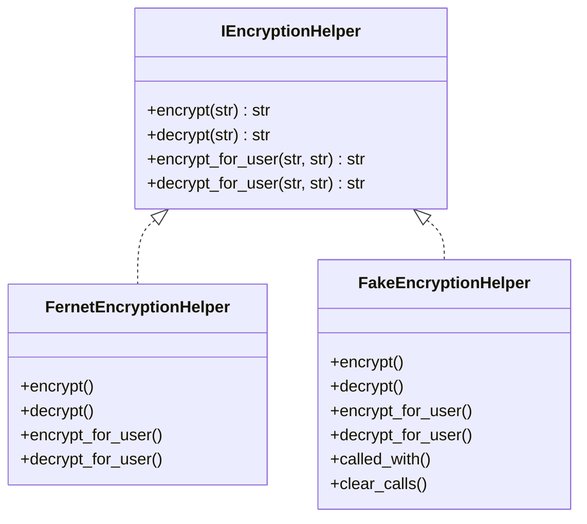
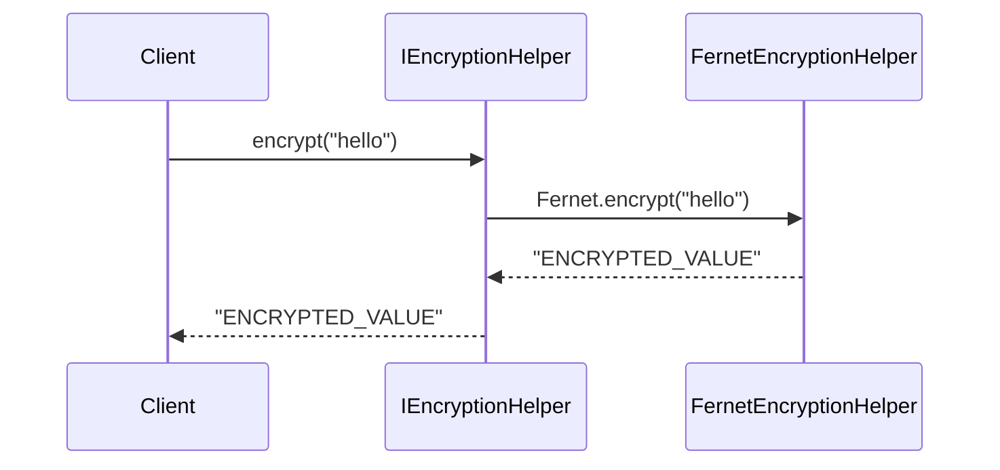

# 🔐 Encryption Service Abstractions

[](https://www.python.org/)
[](https://pypi.org/project/cryptography/44.0.3/)
[](https://docs.pytest.org/)
[](LICENSE)

---

## 📌 Overview

This library provides a clean, pluggable interface for symmetric encryption services, along with a real implementation using **Fernet**, and test doubles such as a **Fake** encryption service. It is designed to be **framework-agnostic**, reusable, and easily injectable into apps like **FastAPI**, **CLIs**, or **background services**.

---

## 🔧 Features

- ✅ Protocol-first design using `Protocol` interface
- ✅ Secure Fernet-based encryption implementation
- ✅ Fake encryption implementation for testing
- ✅ Call-tracking (spy) behavior for test inspection
- ✅ Modular structure for extensibility (AES, Vault, KMS, etc.)
- ✅ 100% pytest-based test coverage

---

## 📁 Project Structure

```text
encryption_src/
├── base/
│   ├── constants.py          # Shared error messages or constant strings
│   ├── exceptions.py          # Contains package specific exceptions
│   └── interface.py          # The IEncryptionHelper protocol
├── fernet/
│   └── service.py            # FernetEncryptionHelper (production impl)
├── test_doubles/
│   ├── __init__.py
│   └── fake_encryption.py    # FakeEncryptionHelper (used in testing)
tests/
└── unit_tests/
    └── fernet/
        └── test_service.py   # Complete test suite using pytest
```

---

## 📜 Interface Definition

### `IEncryptionHelper` (in `base/interface.py`)

```python
class IEncryptionHelper(Protocol):
    def encrypt(self, plaintext: str) -> str: ...
    def decrypt(self, encrypted_text: str) -> str: ...
    def encrypt_for_user(self, plaintext: str, salt_b64: str) -> str: ...
    def decrypt_for_user(self, encrypted_text: str, salt_b64: str) -> str: ...
```

---

## 🧠 Mermaid Diagram — Architecture



---

## 🔐 Fernet Encryption

The production-grade `FernetEncryptionHelper`:

- Uses `cryptography.fernet.Fernet`
- Derives a user-specific key using `PBKDF2HMAC` with SHA-256
- Encrypts and decrypts both globally and per-user using base64 salts
- Raises `MissingEncryptionKeyError` if no key is passed

---

## 🧪 Fake Encryption

The `FakeEncryptionHelper` is a **logic-based test double** that:

- Simulates encryption by returning incrementing tokens
- Tracks all method calls for spying and verification
- Returns `<unknown>` when decrypting unknown tokens
- Uses internal counter to simulate token generation

📌 This class is **safe for test use**, **framework-free**, and **does not require cryptography**.

---

## ✅ Usage

### Install via local path (editable mode)

```bash
pip install -e .
```

### Example: Injecting Fernet in FastAPI

```python
from encryption_src.fernet.service import FernetEncryptionHelper
from app.config import settings

def get_encryption_service():
    return FernetEncryptionHelper(secret_key=settings.SECRET_KEY)
```

### Example: Using Fake in Tests

```python
from encryption_src.test_doubles import FakeEncryptionHelper

def test_something():
    fake = FakeEncryptionHelper()
    token = fake.encrypt("hello")
    assert fake.decrypt(token) == "hello"
```

---

## 🧪 Testing

This project uses [`pytest`](https://docs.pytest.org/) with:

- Full unit test coverage for Fernet
- Invalid inputs, edge cases, and protocol compliance
- Parametrized test inputs

### Run tests:

```bash
pytest
```

---

## 🗺️ Mermaid Diagram — Encryption Flow



---

## 🛠️ Extending the Package

Want to add AES? KMS? Just create a new folder:

```
encryption_src/
├── aes/
│   └── service.py  # AES-based implementation
```

And implement the same interface:
```python
class AESEncryptionService(IEncryptionHelper):
    ...
```

---

## 📚 References

- [Python Protocols (PEP 544)](https://peps.python.org/pep-0544/)
- [Fernet Specification — `cryptography`](https://cryptography.io/en/latest/fernet/)
- [`PBKDF2HMAC` — Key Derivation](https://cryptography.io/en/latest/hazmat/primitives/key-derivation-functions/)
- [`pytest` Testing Framework](https://docs.pytest.org/en/latest/)
---
